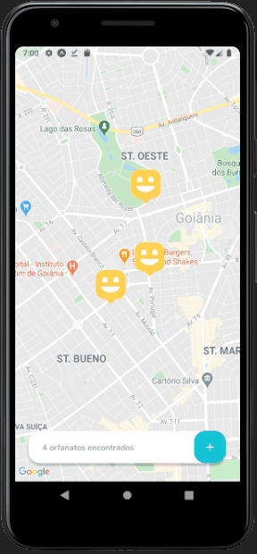

<h1 align="center">
    
</h1>

&nbsp;&nbsp;

### 💻 Projeto

Aplicação desenvolvida durante a Next Level Week #3, da Rocketseat. Happy é uma plataforma que auxilia a encontrar orfanatos próximos na sua cidade, a partir do uso de geolocalização, com o intuito de promover visitas para alegrar as crianças desses abrigos.

### ⚙️ Tecnologias

As tecnologias utilizadas neste projeto foram:

- TypeScript
- ReactJS (frontend web)
- Node.js (backend)
- React Native (mobile)
- Expo (mobile)
- HTML
- CSS

### 🚀 Conhecimentos obtidos neste projeto

- Utilização de mapas com Leaflet e Mapbox API
- Persistência de dados com SQLite
- TypeORM para criação de tabelas e colunas no banco de dados
- Multer para lidar com o upload de arquivos
- Yup para lidar com validação de dados de formulários
- Rotas e métodos HTTP
- Consumo de API externa utilizando axios
- Utilização do Expo para criação da aplicação mobile
- Conceitos React (components, props, states, hooks)
  

### ➕🚀 Features extras

- Configurações de padrões de projeto (ESLINT e Prettier)
- Funcionalidade de entrar em contato com o orfanato pelo WhatsApp
- Funcionalidade de excluir fotos do preview de imagens no formulário de cadastrar novo orfanato
  

### Mobile

### 🎨 Layout

O layout da aplicação está disponível no Figma:

- [Layout Web](https://www.figma.com/file/mDEbnoojksG4w8sOxmudh3/Happy-Web)
- [Layout Mobile](https://www.figma.com/file/X27FfVxAgy9f5IFa7ONlph/Happy-Mobile)
