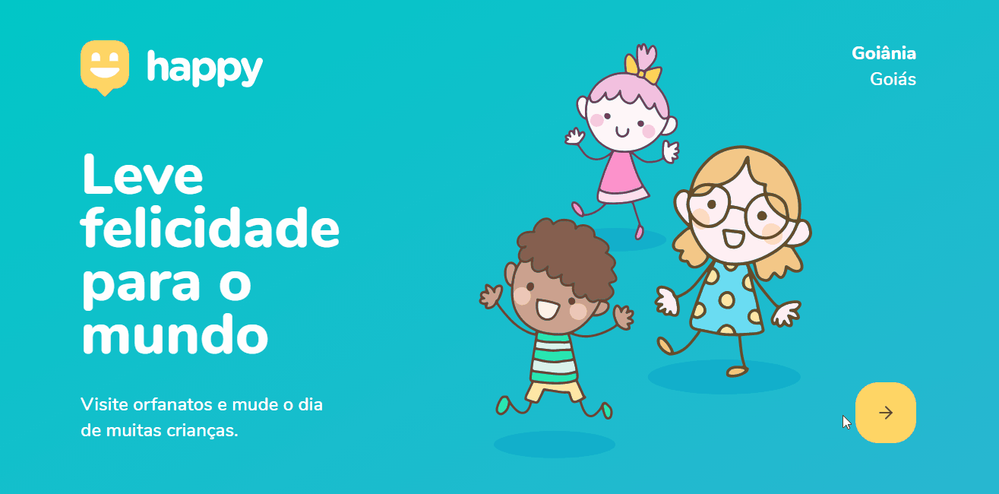

# HAPPY

<h1 align="center">
    
</h1>

## 💻 Projeto
Aplicação desenvolvida durante a Next Level Week #3, da Rocketseat. Happy é uma plataforma que auxilia a encontrar orfanatos próximos na sua cidade, a partir do uso de geolocalização, com o intuito de promover visitas para alegrar as crianças desses abrigos.

### ⚙️ Tecnologias

As tecnologias utilizadas neste projeto foram:

- TypeScript
- ReactJS (front-end web)
- Node.js (backend)
- React Native (mobile)

### 🎨 Layout

O layout da aplicação está disponível no Figma:

